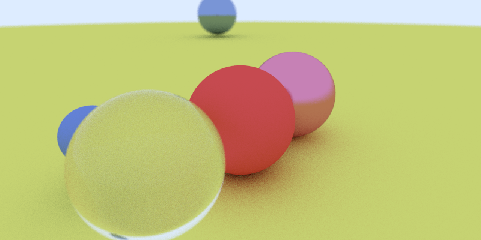

GoTracer
========

A Go implementation of Ray Tracing in One Weekend.  



Provides a library and executable to trace a bunch of spheres with Matte, Metal and transparent surfaces.


## Tracing Specification
This program takes a JSON specification of environment to be traced. Currently only spheres are supported.
```json
{
  "Settings": {
    "ShowProgress": true,
    "RenderRoutines": -1,
    "RenderDepth": 10
  },
  "Image": {
    "OutputFile": "./out/renderedImage.png",
    "Width": 400,
    "Height": 200,
    "Samples": 10,
    "Patch": [0, 200, 0, 400]
  },
  "Camera": {
    "LookFrom": [-2, 1, 0.5],
    "LookAt": [0, 0, -1],
    "UpVector": [0, 1, 0],
    "FieldOfView": 45,
    "AspectRatio": 2,
    "Focus": 2.69,
    "Aperture": 0.04
  },
  "Objects": {
    "Spheres": [
      {
        "Center": [0, 0, -1],
        "Radius": 0.5,
        "Surface": {
          "Type": "Lambertian",
          "Albedo": [0.8, 0.1, 0.1],
          "Fuzz": 0.1,
          "RefIndex": 1.3
        }
      }
    ]
  }
}
```

<table>
    <thead>
        <th colspan="2">Field</th>
        <th>type</th>
        <th>Details</th>
    </thead>
    <tbody>
        <tr>
            <td rowspan="3">Settings</td>
            <td>ShowProgress</td>
            <td>boolean</td>
            <td>Show a progress bar while Image is being rendered</td>
        </tr>
        <td>RenderRoutines</td>
            <td>integer</td>
            <td>Number of goroutines for ray tracing. If value is less than zero then <code>runtime.NumCPU()</code> is taken</td>
        </tr>
        <tr>
            <td>RenderDepth</td>
            <td>integer</td>
            <td>Number of recursion for a ray after hitting an object</td>
        </tr>
        <tr>
            <td rowspan="5">Image</td>
            <td>OutputFile</td>
            <td>string</td>
            <td>Path of file where rendered image should be saved. Rendered image is PNG</td>
        </tr>
        <tr>
            <td>Width</td>
            <td>integer</td>
            <td>Width of Rendered Image</td>
        </tr>
        <tr>
            <td>Height</td>
            <td>integer</td>
            <td>Height of Rendered Image</td>
        </tr>
        <tr>
            <td>Samples</td>
            <td>integer</td>
            <td>Number of samples per pixel</td>
        </tr>
        <tr>
            <td>Patch</td>
            <td>list[int][4]</td>
            <td>Defines specific patch of image to be rendered. Patch is defined as [x0, y0, x1, y1] and all points
            (x, y) are considered given that x0 &le; x &lt; x1 and y0 &le; y &lt; y1 </td>
        </tr>
        <tr>
            <td rowspan="7">Camera</td>
            <td>LookFrom</td>
            <td>list[float][3]</td>
            <td>Coordinates of camera lens</td>
        </tr>
        <tr>
            <td>LookAt</td>
            <td>list[float][3]</td>
            <td>Coordinate of point where camera is pointed.</td>
        </tr>
        <tr>
            <td>UpVector</td>
            <td>list[float][3]</td>
            <td>Point defining direction of up direction for camera</td>
        </tr>
        <tr>
            <td>FieldOfView</td>
            <td>float</td>
            <td>Camera field of views in degrees</td>
        </tr>
        <tr>
            <td>AspectRatio</td>
            <td>float</td>
            <td>Ratio of height and width of camera image plane</td>
        </tr>
        <tr>
            <td>Focus</td>
            <td>float</td>
            <td>Focal length of camera. This and Aperture are used for creation of depth of field effect</td>
        </tr>
        <tr>
            <td>Aperture</td>
            <td>float</td>
            <td>Camera aperture diameter</td>
        </tr>
        <tr>
            <td>Objects</td>
            <td>Spheres</td>
            <td>List[Sphere]</td>
            <td>List of spheres in world to be rendered</td>
        </tr>
        <tr>
            <td rowspan=3>Sphere</td>
            <td>Center</td>
            <td>list[float][3]</td>
            <td>Center of sphere</td>
        </tr>
        <tr>
            <td>Radius</td>
            <td>float</td>
            <td>Radius of sphere</td>
        </tr>
        <tr>
            <td>Surface</td>
            <td>Material</td>
            <td>Material description of Sphere</td>
        </tr>
        <tr>
            <td rowspan="4">Material</td>
            <td>Type</td>
            <td>string</td>
            <td>Type of Material. Must be from <code>Lambertian, Metal, Dielectric</code></td>
        </tr>
        <tr>
            <td>Albedo</td>
            <td>list[float][3]</td>
            <td>Albedo of Material</td>
        </tr>
        <tr>
            <td>Fuzz</td>
            <td>float</td>
            <td>Fuzziness in reflection for <code>Metal</code> surfaces. Should be in range [0.0, 1) </td>
        </tr>
        <tr>
            <td>RefIndex</td>
            <td>float</td>
            <td>Refractive index for <code>Dielectric</code> surfaces.</td>
        </tr>
    </tbody>
</table>

**Note**: list[x][n] => list of elements of type x with size n

## Usages
```bash
go get github.com/DheerendraRathor/GoTracer

goTracer --spec=/path/to/spec.json
```

### As library

```go
package main

import (
	"encoding/json"
	"fmt"
	"io/ioutil"

	"github.com/DheerendraRathor/GoTracer/models"
	"github.com/DheerendraRathor/GoTracer/tracer"
)

func main() {

	file, e := ioutil.ReadFile("mySpecFile.json")
	if e != nil {
		panic(fmt.Sprintf("File error: %v\n", e))
	}

	var env models.World
	json.Unmarshal(file, &env)

	/*
		This channel is used to track progress of ray tracing. If env.Settings.ShowProgress is set to true.
		On each pixel traced a `false` value is pushed to progress channel. And once all pixel are processed a `true` value is pushed into channel.

		It is responsibility of caller to create sufficiently large buffered channel and read it responsibly if env.Settings.ShowProgress is true.
		Otherwise program might hang.
	*/
	progress := make(chan *models.Pixel, 100)
	closeChan := make(chan bool)
	defer close(progress)

	go goTracer.GoTrace(&env, progress, closeChan)

	go func() {
		for pixel := range progress {
			if pixel == nil {
				// Rendering complete
				return
			}
			// Do processing with pixel here.
			// Want to generate JPEG? GIF? Real time rendering on UI? Show weird looking progress bar? Your call. You've the pixels now
		}
	}()

	// To stop rendering in middle, just pass a value to closeChan.
	// GoTracer does a non-blocking check on closeChan before rendering a pixel. If channel has a value, it will stop rendering and send nil to
	// progress channel.
	// Caveat: Existing goroutines for other pixel will continue to run.

}
```
